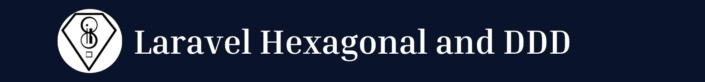

<p align="center"></p>

<p align="center">
    <!-- <a href="https://github.com/kalel1500/laravel-hexagonal-and-ddd-architecture-utilities/actions/workflows/tests.yml"></a> -->
    <a href="https://packagist.org/packages/kalel1500/laravel-hexagonal-and-ddd-architecture-utilities" target="_blank"></a>
    <a href="https://packagist.org/packages/kalel1500/laravel-hexagonal-and-ddd-architecture-utilities" target="_blank"></a>
    <a href="https://packagist.org/packages/kalel1500/laravel-hexagonal-and-ddd-architecture-utilities" target="_blank"></a>
</p>

## ✨ Features

- Utilities for developing in hexagonal architecture and DDD in Laravel.

## Quick start

```bash
composer require kalel1500/laravel-hexagonal-and-ddd-architecture-utilities
```

## Publish files

To publish all the files in the package you can use the following command:

```bash
php artisan vendor:publish --provider="Thehouseofel\Hexagonal\Infrastructure\KalionServiceProvider"
```

Or else you have the following to publish the files independently

```bash
php artisan vendor:publish --tag="kalion-migrations"
php artisan vendor:publish --tag="kalion-views"
php artisan vendor:publish --tag="kalion-view-layout"
php artisan vendor:publish --tag="kalion-config"
php artisan vendor:publish --tag="kalion-config-auth"
php artisan vendor:publish --tag="kalion-config-layout"
php artisan vendor:publish --tag="kalion-config-links"
php artisan vendor:publish --tag="kalion-lang"
```

## License

Laravel Hexagonal and DDD is open-sourced software licensed under the [GNU General Public License v3.0](LICENSE).
